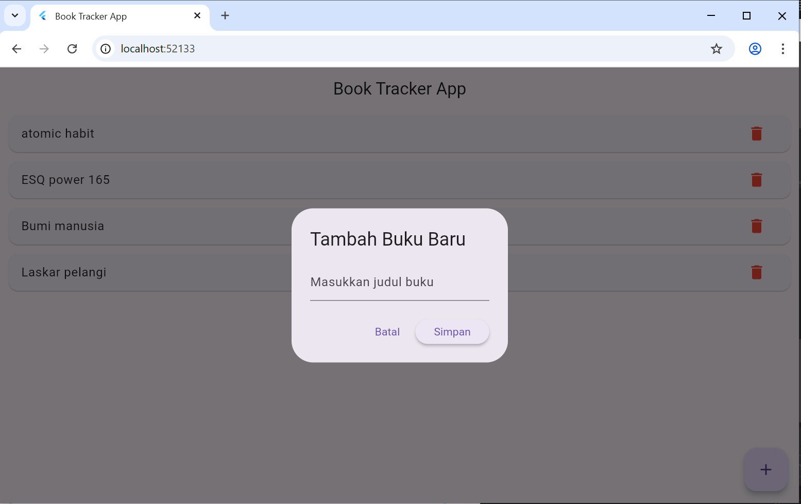

# Book Tracker App

Aplikasi Flutter sederhana untuk mencatat buku yang sedang atau ingin dibaca.

##  Anggota Tim
- Nama: Ibrah Adzdzikra — NIM: 2310120010

##  Tema Aplikasi
Book Tracker App

## 🧩 Deskripsi Fitur
- Menambah buku baru ke daftar.
- Menampilkan semua buku di halaman utama.
- Menghapus buku dari daftar.
- Data disimpan sementara dalam List (tanpa database).

## 🧠 Cara Kerja List
Data disimpan dalam variabel:
```dart
List<String> books = [];
```
Setiap kali pengguna menambah atau menghapus buku, `setState()` digunakan untuk memperbarui tampilan.

## 📱 Tampilan Aplikasi
### 1. Halaman Daftar Buku


### 2. Form Input Buku


## 🧩 Pembagian Tugas
| Anggota | Tugas |
|----------|--------|
| Ibrah Adzdzikra | Coding utama, README, testing, upload GitHub |
